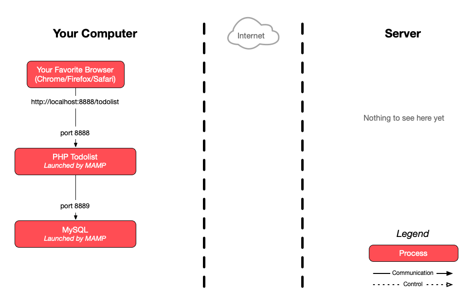

# Collaborative Git Exercise

The goal of this exercise is to collaborate on a simple project on GitHub as a
team of 2 or 3.

<!-- START doctoc generated TOC please keep comment here to allow auto update -->
<!-- DON'T EDIT THIS SECTION, INSTEAD RE-RUN doctoc TO UPDATE -->

- [Legend](#legend)
- [:gem: The application](#gem-the-application)
- [:gem: Tips](#gem-tips)
- [:exclamation: Instructions](#exclamation-instructions)
- [:question: End result](#question-end-result)
- [:exclamation: Evaluation](#exclamation-evaluation)
- [:exclamation: Delivery](#exclamation-delivery)
- [:classical_building: Architecture](#classical_building-architecture)
- [:boom: Troubleshooting](#boom-troubleshooting)
  - [:boom: `You have an error in your SQL syntax [...] near BY`](#boom-you-have-an-error-in-your-sql-syntax--near-by)
  - [:boom: `Uncaught PDOException [...] Access denied`](#boom-uncaught-pdoexception--access-denied)
  - [:boom: `Invalid argument supplied for foreach()`](#boom-invalid-argument-supplied-for-foreach)
  - [:boom: Adding a todo item redirects to another URL](#boom-adding-a-todo-item-redirects-to-another-url)
  - [:boom: The application displays correctly but modifications are not taken into account](#boom-the-application-displays-correctly-but-modifications-are-not-taken-into-account)

<!-- END doctoc generated TOC please keep comment here to allow auto update -->


## Legend

Parts of this guide are annotated with the following icons:

- :exclamation: A task you **MUST** perform to complete the exercise.
- :question: An optional step that you _may_ perform to make sure that
  everything is working correctly.
- :warning: **Critically important information about the exercise.**
- :gem: Tips on the exercise, reminders about previous exercises, or
  explanations about how this exercise differs from the previous one.
- :space_invader: More advanced tips on how to save some time. Challenges.
- :books: Additional information about the exercise or the commands and tools
  used.
- :checkered_flag: The end of the exercise.
  - :classical_building: The architecture of what you deployed during the
    exercise.
- :boom: Troubleshooting tips: how to fix common problems you might encounter.


## :gem: The application

This repository contains a partially implemented todo list written in PHP, HTML
and CSS. The application connects to a MySQL database. All the code is in the
`index.php` file.

The incomplete lines of code are marked with the following comment: `// IMPLEMENT ME`.


## :gem: Tips

* :gem: You may run this application on your local machine with [MAMP][mamp] or
  [WAMP][wamp], or with a local installation of PHP and MySQL if you already
  have them.
* :gem: This repository contains a `todolist.sql` file you can use to create the
  database for this project. If you use MAMP, you can run its contents from
  MAMP's phpMyAdmin interface.

  You should **change the password** in the SQL before running it.
* :gem: Need help choosing a good password? [Don't use something that is hard to
  remember](https://xkcd.com/936/). You're better off [using a
  passphrase](https://www.useapassphrase.com) (here's a [French
  version](https://passwordcreator.org/fr.html#good)).
* :gem: You can update the [constants at the top of `index.php`][ex-constants]
  to match your local installation:
  * The value of `BASE_URL` must match the URL at which the application is
    available.

    For example, if you use MAMP and put this repository in MAMP's `htdocs`
    directory, the application will be accessible at
    http://localhost:8888/comem-archidep-php-todo-exercise/ (with the default
    ports). In this situation, the value of `BASE_URL` should be
    `/comem-archidep-php-todo-exercise/`.
  * You can change the value of `DB_PORT` to match your local MySQL port (for
    example, with MAMP, the default is 8889).


## :exclamation: Instructions

The first two team members will be referred to as **Alice** and **Bob**.

1. **Alice**
   * Open the [MediaComem/comem-archidep-php-todo-exercise repository][ex-repo]
     in your browser.
   * Click the **`Fork`** button in the top-right corner of the page (you must
     be logged in to GitHub).

     

     This will create a copy of the repository on GitHub that belongs to you
     (under your GitHub username instead of `MediaComem`).
   * In the settings of the forked repository, add **Bob** and any other team
     members to the list of **Collaborators** (this will give them push access).
   * Clone the forked repository on your local machine.
2. **Bob** (and other team members)
   * Clone Alice's repository on your local machine.
3. **All**
   * Implement one or more of the missing features.
   * Commit the changes and push them to Alice's repository on GitHub.


## :question: End result

The fully implemented application should look and behave like this:
https://todolist.archidep.ch


## :exclamation: Evaluation

* The work must be delivered in the forked repository on GitHub.
* The todo list must work:
  * Tasks can be added, toggled and deleted.
  * Tasks must be listed from newest to oldest (i.e. by descending creation
    date).
* Each team member must contribute at least one useful commit:
  * The commits must be made on each team member's machine using their local Git
    installation, not through GitHub's web interface.
  * The author name and email address of each team member's commits must be
    correctly configured.
* Commit messages must be relevant (i.e. describe the change that was made).


## :exclamation: Delivery

Send one email per team to both teachers (Simon O. & Simon P.) with:

* The link to the team's solution repository on GitHub.
* The list of team members (and their GitHub username if it is not obvious).


## :classical_building: Architecture

This is a simplified architecture of the main running processes and
communication flow at the end of the exercise (assuming you've used MAMP with
Apache running on port 8888 and MySQL on port 8889).



> [PDF version](./images/simplified-architecture.pdf).


## :boom: Troubleshooting

> Note that PHP errors may appear only in your PHP error log, or also in your
> browser. Whether they appear in your browser depends on parameters in your
> `php.ini` configuration, such as
> [`error_reporting`](https://www.php.net/manual/en/errorfunc.configuration.php#ini.error-reporting).

### :boom: `You have an error in your SQL syntax [...] near BY`

The `todolist.sql` file contains the following query:

```sql
CREATE USER IF NOT EXISTS 'todolist'@'localhost' IDENTIFIED WITH mysql_native_password BY 'chAngeMeN0w!';
```

The `WITH mysql_native_password` portion of this query is required for some
older versions of MySQL. If you get a syntax error message when you run it,
simply remove that part and use only `IDENTIFIED BY`.

### :boom: `Uncaught PDOException [...] Access denied`

If you see an error that looks like this displayed in your browser or in the PHP
error log:

```
PHP Fatal error:
  Uncaught PDOException: SQLSTATE[HY000] [1045]
  Access denied for user 'todolist'@'localhost' (using password: YES)
```

It means that you are not using the correct database connection parameters. Make
sure that the following parameters are configured correctly:

* The `DB_PASS` parameter must be the password you used when you created the
  `todolist` user with the SQL in the `todolist.sql` file.
* The `DB_PORT` parameter must be the port on which you MySQL server is
  listening. The default MySQL port is 3306, but it may be different depending
  on your installation method. For example, MAMP uses port 8888 by default.

> You may also have made a mistake when creating the MySQL user. If you are not
> sure, you can delete the user by running the query `DROP USER
> 'todolist'@'localhost';`, then re-run the `CREATE USER ...` and `GRANT ALL
> PRIVILEGES ...` queries of the `todolist.sql` file.

### :boom: `Invalid argument supplied for foreach()`

If you see an error that looks like this displayed in your browser or in the PHP
error log:

```
PHP Warning: Invalid argument supplied for foreach()
```

It is simply because you have not yet implemented the `SELECT` query in the
`$selectQuery` variable. This makes the `$items` variable empty, which produces
an error in the `foreach` loop that attempts to iterate over it to display the
todo items.

### :boom: Adding a todo item redirects to another URL

You have not configured the `BASE_URL` parameter correctly. This value is used
in the [form's `action`
attribute](https://www.w3schools.com/tags/att_form_action.asp) when creating a
todo item.

The correct value is the base path under which the application is exposed. For
example, if you are accessing the application at
`http://localhost:8888/comem-archidep-php-todo-exercise/`, then `BASE_URL`
should be `/comem-archidep-php-todo-exercise/`. If you are accessing the
application at `http://localhost:8888`, then `BASE_URL` should be `/`.

### :boom: The application displays correctly but modifications are not taken into account

You may have configured your `BASE_URL` without a trailing slash (e.g.
`/comem-archidep-php-todo-exercise` instead of
`/comem-archidep-php-todo-exercise/`).

The Apache web server (in MAMP or equivalent) will not treat requests to those
two paths in the same way:

* The first path `/comem-archidep-php-todo-exercise` will probably be redirected
  to `/comem-archidep-php-todo-exercise/` with a standard Apache configuration.
  Any form data submitted in the request will be lost in the redirection.
* The second path `/comem-archidep-php-todo-exercise/` refers to the directory
  by the same name. In that case, a standard Apache configuration will probably
  execute the `index.php` page in that directory.

Without the trailing slash, your application may display correctly, but form
submission may be broken.


[ex-constants]: https://github.com/MediaComem/comem-archidep-php-todo-exercise/blob/master/index.php#L3-L8
[ex-repo]: https://github.com/MediaComem/comem-archidep-php-todo-exercise
[mamp]: https://www.mamp.info/
[wamp]: http://www.wampserver.com/
