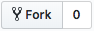

# Collaborative Git Exercise

The goal of this exercise is to collaborate on a simple project on GitHub as a team of 2 or 3.

<!-- START doctoc generated TOC please keep comment here to allow auto update -->
<!-- DON'T EDIT THIS SECTION, INSTEAD RE-RUN doctoc TO UPDATE -->

- [Application](#application)
  - [Tips](#tips)
- [Instructions](#instructions)
- [Evaluation](#evaluation)
- [Delivery](#delivery)

<!-- END doctoc generated TOC please keep comment here to allow auto update -->

## Application

This repository contains a partially implemented todo list written in PHP, HTML and CSS.
The application connects to a MySQL database.
All the code is in the `index.php` file.

The incomplete lines of code are marked with the following comment: `// IMPLEMENT ME`.

### Tips

* You may run this application on your local machine with [MAMP][mamp] or [WAMP][wamp], or with a local installation of PHP and MySQL if you already have them.
* This repository contains a `todolist.sql` file you can use to create the database for this project.

  If you use MAMP, you can run its contents from MAMP's phpMyAdmin interface.
* You can update the [constants at the top of `index.php`][ex-constants] to match your local installation:
  * The value of `BASE_URL` must match the URL at which the application is available.

    For example, if you use MAMP and put this repository in MAMP's `htdocs` directory,
    the application will be accessible at http://localhost:8888/comem-archidep-php-todo-exercise/ (with the default ports).
    In this situation, the value of `BASE_URL` should be `/comem-archidep-php-todo-exercise/`.
  * You can change the value of `DB_PORT` to match your local MySQL port (for example, with MAMP, the default is 8889).

## Instructions

The first two team members will be referred to as **Bob** and **Alice**.

1. **Bob**
   * Open the [MediaComem/comem-archidep-php-todo-exercise repository][ex-repo] in your browser.
   * Click the **`Fork`** button in the top-right corner of the page (you must be logged in to GitHub).

     

     This will create a copy of the repository on GitHub that belongs to you (under your GitHub username instead of `MediaComem`).
   * In the settings of that repository, add **Alice** and any other team members to the list of **Collaborators** (this will give them push access).
   * Clone the repository on your local machine.
2. **Alice** (and other team members)
   * Clone Bob's repository on your local machine.
3. **All**
   * Implement one or more missing feature.
   * Commit the change and push it to Bob's repository on GitHub.

## Evaluation

* The work must be delivered in the forked repository on GitHub.
* The todo list must work.
  * Tasks can be added, toggled and deleted.
  * Tasks must be listed from newest to oldest (i.e. by descending creation date).
* Each team member must contribute at least one useful commit.
  * The author name and email address of each team member's commits must be correctly configured.
* Commit messages must be relevant (i.e. describe the change that was made).

## Delivery

Send one email per team to the teacher with:

* The link to the team's solution repository on GitHub.
* The list of team members (and their GitHub username if it is not obvious).

[ex-constants]: https://github.com/MediaComem/comem-archidep-php-todo-exercise/blob/master/index.php#L3-L8
[ex-repo]: https://github.com/MediaComem/comem-archidep-php-todo-exercise
[mamp]: https://www.mamp.info/
[wamp]: http://www.wampserver.com/
